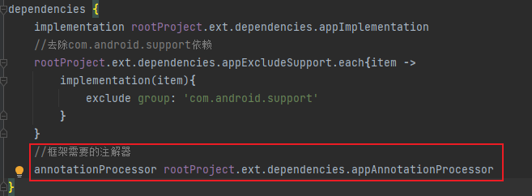
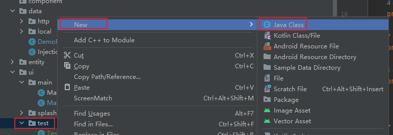
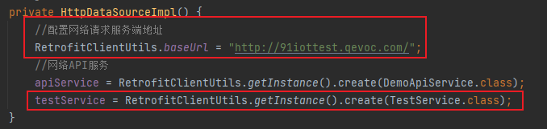

# MVVM开发规范

## 1.目录结构介绍

### 1.1 配置文件config.gradle

1. android开发版本配置

* 主要作用是为了统一主程序（app）和模块（module）中build.gradle文件里的android配置信息，其中applicationId配置只有主程序需要，在打包时可以在不同环境下配置不同的包名。
* 示例：
  * config.gradle:
    ```
    //android开发版本配置
      android = [
              compileSdkVersion: 34,//aac最低支持
              namespace        : "com.xxy.mvvmdemo",
              applicationId    : "com.xxy.mvvmdemo",
              minSdkVersion    : 23,
              targetSdkVersion : 28,
              versionCode      : 101,
              versionName      : "1.0.1",
      ] 
    ```
  * app项目下build.gradle:
    ```
    android {
      namespace rootProject.ext.android.namespace
      compileSdk rootProject.ext.android.compileSdkVersion
      defaultConfig {
          applicationId rootProject.ext.android.applicationId
          minSdk rootProject.ext.android.minSdkVersion
          targetSdk rootProject.ext.android.targetSdkVersion
          versionCode rootProject.ext.android.versionCode
          versionName rootProject.ext.android.versionName

          testInstrumentationRunner "androidx.test.runner.AndroidJUnitRunner"
      }
    }
    ```

2. 依赖第三方配置

* dependencies数组内部可以定义多个配置，如果是需要定义数组类型的配置，推荐（不强求）模块名+引用方式的命名方式，例如app+implementation（appImplementation）、app+annotationProcessor(appAnnotationProcessor)；如果是定义字符串类型的配置，推荐（不强求）使用依赖的name来定义，例如com.google.android.material:material:1.5.0这个依赖的name为冒号后面的部分material，那就参照下列方式来定义：
  ```
  'material' :   'com.google.android.material:material:1.5.0',
  ```
* 当前目录下主要有四种数组配置:
  1. appImplementation：主程序app里使用implementation来引用的依赖；
     
  2. appExcludeSupport：主程序app里需要去除com.android.support包的依赖；
     
  3. appAnnotationProcessor：主程序app里使用annotationProcessor来引用的依赖；
     
  4. other：收集的一些暂未使用的依赖；
  5. 其中appImplementation、appExludeSupport和appAnnotationProcessor配置里的数据项可以增加但不建议开发者删除，如果碰到因为依赖版本问题导致报错可以更新版本号并推送到模版项目。

### 1.2 主程序app模块的目录结构


* app：影响全局的文件，例如Application文件；
* binding：控件跟视图的绑定逻辑，可以自己定义；
* component：自定义View；
* data：数据文件，包括本地和网络；
* entity：数据实体对象；
* ui：对应应用里的每一个界面；
* utils：自定义的工具类。

## 2 常用场景

1. 创建一个界面

* 在ui目录夹下创建新的界面文件夹（建议文件夹的命名全部使用小写）
  
  
* 在新文件夹test下创建ViewModel
  
  
* 在新文件夹test下创建Activity和布局文件
  
  
* 将布局文件转换为数据绑定布局
  * 在页面布局中，使用快捷键Alt+Enter，出现提示菜单，点击“Convert to data binding layout”即可
    
    
  * 声明一个viewModel变量
    
* 修改创建的Activity内部结构
  更改继承的AppCompatActivity为BaseActivity，删除onCreate方法，实现initContentView和initVariableId抽象方法，重写initViewModel方法：
  
  其中ActivityTestBinding为上一步实现的数据绑定布局，TestViewModel是我们创建的ViewModel文件。
* 修改AndroidManifest文件的报错
  

2. 创建一个网络接口

* 在HttpDataSourceImpl文件中配置网络请求服务端地址
  
* 在service目录夹下创建新的服务接口文件
  
  
* 使用Retrofit注释的方法来实现接口
  
  * 其中GET、POST、DELETE、PUT按照接口实际情况配置，后面的url按照具体接口来配置；
    BaseResponseEntity这个类是框架中预先定义好的外层结构，如下所示：
    
  * 除此以外，还有BaseListResponseEntity也是预先定义好的，如下所示:
    
* 在HttpDataSource中定义好对应的接口
  
* 在HttpDataSourceImpl中完成接口的具体实现
  
  
  
* 在DemoResitory中完成接口的具体实现
  
* 在ViewModel中使用rxjava操作符调用
  

3. 创建一个本地数据接口

* 在entity目录下创建表实体
  
  
* 在dao目录夹实现增删查改等据库操作（可以结合livedata一起使用）
  
  
* 更改AppDatabase类中的代码：增加entities、提高version并创建testDao方法
  
  
* 更改DbHelper类中的代码：增加获取数据表的方法
  
  
* 在LocalDataSource中定义好对应的接口
  
* 在LocalDataSourceImpl中完成接口的具体实现
  
  
  
* 在DemoRepository中完成接口的具体实现
  
* 在ViewModel和Activity中使用
  
  

4. 创建一个数据绑定

* 在binding下新建名为控件名的文件夹
  
* 在新文件夹下创建ViewAdapter文件
  
* 在控件中创建一个数据绑定
  
* 在attrs目录夹创建对应的属性
  
  
* 在viewModel中定义一个字符串的数据项
    ```
    public ObservableField<String> titleStr = new ObservableField<>("标题");
    ```
* 在界面中ActionBarCommon标签绑定
  

5. 创建一个事件绑定

* 在binding下新建名为控件名的文件夹
  
* 在新文件夹下创建ViewAdapter文件
  
* 在控件中创建一个事件绑定
  
* 在attrs目录夹创建对应的属性
  
  ```
  <attr format="reference" name="titleOnClick"/>
  ```
* 在viewModel中定义事件
  ```
  public BindingCommand titleOnClickEvent = new BindingCommand(() -> {
        ToastUtils.showShort(titleStr.get());
  });
  ```
* 在界面中ActionBarCommon标签绑定
  

